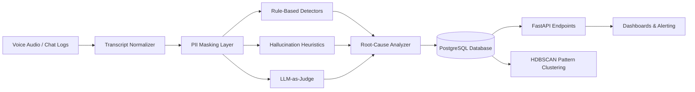

# ConvoLens: Automated Quality Evaluation & Failure-Taxonomy Platform for Voice and Chat AI Agents

[](https://www.python.org/downloads/)
[](https://fastapi.tiangolo.com)
[](https://docs.pydantic.dev/)
[](LICENSE)

---

## 1. Business Problem

Enterprise contact centers and customer-facing organizations deploying voice and in-app AI agents (across BFSI onboarding, collections, insurance claims, and sales) can manually review only **1% to 3%** of their total conversational volume. 

Critical failure modes go completely undetected until customer churn or regulatory fines occur:
* **Hallucinated interest rates & repayment dates** causing compliance breaches.
* **Repetitive conversational loops** when customer objections cannot be resolved.
* **Context loss** across long turns where slot values (e.g. loan tenure, income) are dropped.
* **Speech-layer degradation** (ASR homophone confusion, speech collisions, barge-in failures).
* **Undiagnosable quality drops** whenever developers update prompts or retrieval models without regression guarantees.

**ConvoLens** provides a production-grade automated evaluation and root-cause intelligence engine. It continuously evaluates 100% of dialogue turns against an enterprise-grade rubric, maps failures to responsible system layers, clusters recurring failure patterns, and delivers prioritized fixes to engineering teams.

---

## 2. Tech Stack

* **Core Platform & Data**: Python 3.11+, Pandas, NumPy, Pydantic v2, Pydantic-Settings
* **Database & Persistence**: SQLAlchemy 2.0 (PostgreSQL in production with `pgvector`, SQLite for local development)
* **ASR & Audio Ingestion**: Deepgram / Whisper transcript normalization with word-level timestamps and speaker diarization
* **LLM Judges**: Anthropic Claude (Claude 3.5 Sonnet) and OpenAI (GPT-4o) via structured JSON schema enforcement
* **Rule Engine**: Deterministic `difflib` similarity detectors, silence interval checkers, and acoustic confidence guards
* **Embeddings & Pattern Clustering**: `sentence-transformers` (`all-MiniLM-L6-v2`), HDBSCAN, UMAP
* **Security & Privacy**: Zero-trust regex PII Masking Engine (Aadhaar, PAN, phone numbers, emails, payment cards)
* **API & Service Delivery**: FastAPI, Uvicorn, Structlog, CORS middleware
* **Deployment & Containers**: Docker, Docker Compose, GitHub Actions CI

---

## 3. Architecture & Data Flow



1. **Ingestion & Normalization**: Audio and chat logs from webhooks or batch buckets are normalized into a unified dialogue schema (`Conversation`, `Turn`, `SpeakerRole`, `ToolCall`).
2. **PII Masking**: Customer identifiers (PAN, Aadhaar, phone numbers, payment cards) are masked before LLM transmission.
3. **Hybrid Evaluation Layer**: Combines sub-10ms rule-based detectors (repetitions, silences, low confidence) with LLM chain-of-thought grading for nuanced cognitive failures.
4. **Root-Cause Attribution Matrix**: Maps flagged failures directly to responsible architecture layers (`prompt`, `kb_gap`, `tool_failure`, `context_management`, `asr`, `tts`, `workflow`).
5. **Pattern Mining**: Embeds failed turns, groups them into semantically coherent clusters via HDBSCAN, and auto-labels systemic bugs.

---

## 4. Failure Taxonomy & Scoring Rubric

### Two-Level Failure Taxonomy

| Level | Code | Category | Default Severity | Description |
| :--- | :--- | :--- | :---: | :--- |
| **Level 1** | `L1-HAL` | **Hallucination** | **S1** | Factual fabrication, ungrounded rate/fee quotes, policy distortion. |
| | `L1-CTX` | **Context Loss** | **S2** | Forgets earlier statements, contradicts previous turns, drops slots. |
| | `L1-LOOP` | **Loops / Repetition** | **S2** | Asks identical questions, repeats phrases, stuck dialogue loops. |
| | `L1-INT` | **Intent Misread** | **S2** | Misinterprets user intent, wrong branch routing, premature escalation. |
| | `L1-OBJ` | **Weak Objection** | **S3** | Ignores customer pushback, delivers cookie-cutter dismissive replies. |
| | `L1-INS` | **Instruction Breach**| **S1** | Omits mandatory disclosures, violates compliance scripts or register. |
| | `L1-GOAL` | **Goal Failure** | **S1** | Call ends without completing verified loan/onboarding outcome. |
| **Level 2** | `L2-ASR` | **ASR Error** | **S3** | Speech-to-text acoustic distortion, homophone and proper noun errors. |
| | `L2-TTS` | **TTS Pronunciation**| **S3** | Speech synthesis mispronounces critical numbers, amounts, or terms. |
| | `L2-BARG`| **Barge-in / VAD** | **S3** | Agent speaks over customer, premature cutoff, silence timeouts. |

### Scoring Rubric (1–5 Scale)

$$\text{Composite Quality Score} = 0.35 \times \text{Accuracy} + 0.20 \times \text{Empathy} + 0.20 \times \text{Flow} + 0.25 \times \text{Goal Completion}$$

---

## 5. Directory Structure

```text
convolens-ai-qa/
├── configs/
│   ├── judge_prompts.yaml        # LLM judge prompt templates (turn, conversation, cluster)
│   └── taxonomy.yaml             # Complete failure taxonomy, rubric weights, and root causes
├── data/
│   └── samples/
│       └── sample_conversation.json # 15-turn BFSI loan collection benchmark conversation
├── docs/
│   ├── architecture.md           # Detailed technical specifications and flowcharts
│   └── taxonomy.md               # Behavioral anchors and rubric reference tables
├── scripts/
│   └── seed_sample.py            # Standalone demonstration and end-to-end evaluation runner
├── src/
│   ├── api/
│   │   ├── middleware.py         # Request logging, CORS, error handling
│   │   └── routes/
│   │       ├── evaluation.py     # POST /evaluate/conversation, POST /evaluate/raw
│   │       ├── results.py        # GET /results/{conversation_id}
│   │       └── trends.py         # GET /trends (distribution, root causes, averages)
│   ├── db/
│   │   └── session.py            # Engine initialization, SQLite WAL mode, session factory
│   ├── evaluation/
│   │   ├── hallucination.py      # Rule-based numeric & authority claim verification
│   │   ├── llm_judge.py          # Claude/GPT structured Pydantic evaluation judge
│   │   ├── pipeline.py           # Master evaluation pipeline & DB persistence orchestrator
│   │   ├── root_cause.py         # Deterministic root-cause decision attribution engine
│   │   └── rule_detectors.py     # Repetition, long silence, and low ASR confidence detectors
│   ├── ingestion/
│   │   └── normalizer.py         # Deepgram, Whisper, and simple transcript normalizer
│   ├── mining/
│   │   ├── clustering.py         # HDBSCAN clustering & UMAP dimensionality reduction
│   │   ├── embeddings.py         # Sentence-transformers embedding extraction
│   │   └── trend_detection.py    # Time-series and categorical aggregation queries
│   ├── models/
│   │   └── database.py           # SQLAlchemy ORM models (Conversation, Turn, Evaluation, Failure)
│   ├── pii/
│   │   └── masker.py             # Regex PII detection & masking for PAN, Aadhaar, Phone, Email
│   ├── schemas/
│   │   ├── api.py                # Request and response models
│   │   ├── conversation.py       # Conversation, Turn, SpeakerRole, ToolCall schemas
│   │   └── evaluation.py         # EvaluationResult, RubricScores, FailureRecord, Severity
│   ├── utils/
│   │   └── logging.py            # Centralized application logging
│   ├── config.py                 # Application settings via pydantic-settings
│   └── main.py                   # FastAPI application factory and lifecycle
├── tests/
│   ├── conftest.py               # Shared pytest fixtures, SQLite test database setup
│   ├── test_api.py               # Integration tests for FastAPI endpoints
│   ├── test_llm_judge.py         # Tests for fallback and structured output parsing
│   ├── test_pii_masker.py        # Tests for Aadhaar, PAN, phone, email masking
│   ├── test_pipeline.py          # End-to-end evaluation pipeline verification
│   ├── test_root_cause.py        # Decision engine unit tests across 7 attribution layers
│   └── test_rule_detectors.py    # String similarity and acoustic threshold tests
├── .env.example                  # Environment configuration template
├── .gitignore                    # Comprehensive Python and system gitignore
├── DEVELOPMENT.md                # Local setup, API curl examples, and development guidelines
├── docker-compose.yml            # Multi-service setup (FastAPI + PostgreSQL)
├── Dockerfile                    # Production container build
└── requirements.txt              # Pinned Python package dependencies
```

---

## 6. Quick Start

### 1. Run the Evaluation Pipeline on Sample Data

```bash
# Set up environment
python -m venv .venv
source .venv/bin/activate  # On Windows: .venv\Scripts\activate
pip install -r requirements.txt

# Run the end-to-end evaluation demo
python -m scripts.seed_sample
```

### 2. Start the API Server

```bash
uvicorn src.main:app --reload --host 0.0.0.0 --port 8000
```

Open interactive Swagger API documentation in your browser:
**`http://localhost:8000/docs`**

### 3. Run the Test Suite

```bash
pytest -v
```

---

## 7. API Reference

| Method | Endpoint | Description |
| :--- | :--- | :--- |
| `GET` | `/health` | Health check endpoint returning database connectivity status |
| `POST` | `/evaluate/conversation` | Ingests a structured conversation payload and runs full evaluation |
| `POST` | `/evaluate/raw` | Ingests raw Deepgram/Whisper/generic JSON and normalizes before evaluation |
| `GET` | `/results/{conversation_id}` | Retrieves persisted evaluation scores, failure records, and root-cause fixes |
| `GET` | `/trends` | Aggregates failure distributions by category, severity, and root causes |

---

## 8. License

This project is licensed under the MIT License. See [LICENSE](LICENSE) for details.
