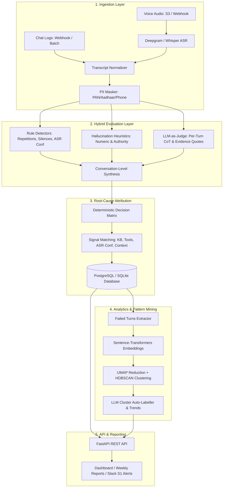

# ConvoLens System Architecture & Technical Specifications

## Core Architectural Pillars

### 1. Zero-Trust PII Masking Pipeline
Before any transcript turn is forwarded to external LLM providers (Anthropic Claude or OpenAI), the text passes through regex-based masking targeting Indian and international PII entities:
- **Aadhaar Numbers**: `\b\d{4}[\s\-]?\d{4}[\s\-]?\d{4}\b` -> `[AADHAAR]`
- **PAN Cards**: `\b[A-Z]{5}\d{4}[A-Z]\b` -> `[PAN]`
- **Phone Numbers**: `(?:\+91[\s\-]?|0)?[6-9]\d{4}[\s\-]?\d{5}\b` -> `[PHONE]`
- **Email & Payment Cards**: Standard RFC and Luhn-length credit card filters.
Original raw text remains securely stored within the local database instance for auditability.

### 2. Hybrid Evaluation Strategy
1. **Rule Engine (<10ms execution)**:
   - Near-duplicate detection using normalized `difflib.SequenceMatcher` with a sliding turn window.
   - Long silence timeouts (>8,000ms threshold).
   - Audio confidence dipping below configurable threshold (default: 0.60).
2. **Deterministic Hallucination Guards**:
   - Compares numeric assertions (rates, fees, dates) against present KB snippets or tool returns.
   - Flags authority assertions ("our records show") made in turns lacking tool call verifications.
3. **LLM-as-Judge**:
   - Claude 3.5 Sonnet / GPT-4o structured JSON evaluations adhering to Pydantic schemas.
   - Generates per-turn scores, severity ratings, transcript quotes, and rationale.

### 3. Root-Cause Attribution Engine
Deterministic signal matching eliminates ambiguity when routing fixes:
- `Tool Call Failure + Hallucinated Value` $\rightarrow$ **`RC-TOOL`**
- `Missing KB Snippet + Ungrounded Claim` $\rightarrow$ **`RC-KB`**
- `Available KB Fact + Contradicted Agent Claim` $\rightarrow$ **`RC-PROMPT`**
- `Long Dialogue (>15 turns) + Forgotten Earlier Slot` $\rightarrow$ **`RC-CONTEXT`**
- `Turn ASR Confidence < 0.65 + Intent Misread` $\rightarrow$ **`RC-ASR`**

### 4. Gold Set Calibration & Regression Testing
ConvoLens supports continuous judge calibration:
- Maintains a 300–500 turn human-labeled gold benchmark with double review.
- Computes Cohen's Kappa ($\kappa$) inter-annotator agreement between Human-Human and Human-Judge.
- Automatically gates prompt deployments in CI if $\kappa < 0.70$ on gold test suites.
